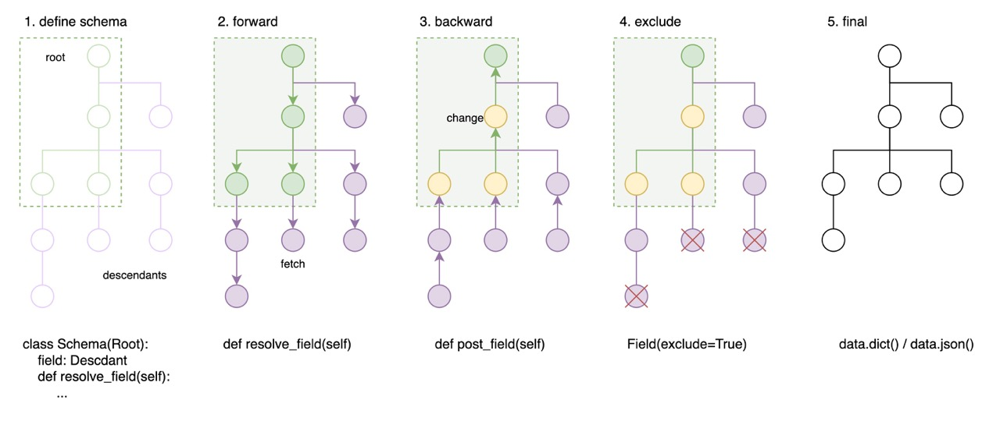

[](https://pypi.python.org/pypi/pydantic-resolve)
[](https://pepy.tech/project/pydantic-resolve)


[](https://github.com/allmonday/pydantic_resolve/actions/workflows/ci.yml)


A hierarchical solution for data fetching and processing

1. use declaretive way to define view data, easy to maintain and develop
2. use main query and loader query to break down complex queries, and better reuse
3. provide various tools to precisely construct view data, no overhead


> If you are using pydantic v2, please use [pydantic2-resolve](https://github.com/allmonday/pydantic2-resolve) instead.

> It is the key to composition-oriented-development-pattern (wip) 
> https://github.com/allmonday/composition-oriented-development-pattern

[Discord](https://discord.com/channels/1197929379951558797/1197929379951558800)

[Change Logs](./changelog.md)

## Install

```shell
pip install pydantic-resolve
```

## Concept

It taks 5 steps to convert from root data into view data.

1. define schema of root data and descdants & load root data
2. forward-resolve all descdants data
3. backward-process the data
4. tree shake the data marked as exclude=True
5. get the output



How resolve works, level by level:


## Quick start

Basic usage, resolve your fields.  (`N+1` query will happens in batch scenario)

Let's build a blog site with blogs and comments.

[0_demo.py](./examples/0_demo.py)

```python
import asyncio
from pydantic import BaseModel
from pydantic_resolve import Resolver

comments_table = [
    dict(id=1, blog_id=1, content='its interesting'),
    dict(id=2, blog_id=1, content='i dont understand'),
    dict(id=3, blog_id=2, content='why? how?'),
    dict(id=4, blog_id=2, content='wow!')]

async def query_comments(blog_id: int):
    print(f'run query - {blog_id}')
    return [c for c in comments_table if c['blog_id'] == blog_id]

async def get_blogs():
    return [
        dict(id=1, title='what is pydantic-resolve'),
        dict(id=2, title='what is composition oriented development pattarn'),
    ]

class Comment(BaseModel):
    id: int
    content: str

class Blog(BaseModel):
    id: int
    title: str

    comments: list[Comment] = []
    async def resolve_comments(self):
        return await query_comments(self.id)

    comment_count: int = 0
    def post_comment_count(self):
        return len(self.comments)


class MyBlogSite(BaseModel):
    name: str

    blogs: list[Blog] = []
    async def resolve_blogs(self):
        return await get_blogs()

    comment_count: int = 0
    def post_comment_count(self):
        return sum([b.comment_count for b in self.blogs])

async def single():
    blog = Blog(id=1, title='what is pydantic-resolve')
    blog = await Resolver().resolve(blog)
    print(blog)

async def batch():
    my_blog_site = MyBlogSite(name: "tangkikodo's blog")
    my_blog_site = await Resolver().resolve(my_blog_site)
    print(my_blog_site.json(indent=4))


async def main():
    await single()
    # query_comments():
    # >> run query - 1

    await batch()
    # query_comments(): Ooops!, N+1 happens
    # >> run query - 1
    # >> run query - 2

asyncio.run(main())
```

output of my_blog_site:
```json
{
    "name": "tangkikodo's blog",
    "blogs": [
        {
            "id": 1,
            "title": "what is pydantic-resolve",
            "comments": [
                {
                    "id": 1,
                    "content": "its interesting"
                },
                {
                    "id": 2,
                    "content": "i dont understand"
                }
            ],
            "comment_count": 2
        },
        {
            "id": 2,
            "title": "what is composition oriented development pattarn",
            "comments": [
                {
                    "id": 3,
                    "content": "why? how?"
                },
                {
                    "id": 4,
                    "content": "wow!"
                }
            ],
            "comment_count": 2
        }
    ],
    "comment_count": 4
}
```

Optimize `N+1` with dataloader

[0_demo_loader.py](./examples/0_demo_loader.py)

- change `query_comments` to `blog_to_comments_loader` (loader function)
- user loader in `resolve_comments`

```python
from pydantic_resolve import LoaderDepend

async def blog_to_comments_loader(blog_ids: list[int]):
    print(blog_ids)
    return build_list(comments_table, blog_ids, lambda c: c['blog_id'])

class Blog(BaseModel):
    id: int
    title: str

    comments: list[Comment] = []
    def resolve_comments(self, loader=LoaderDepend(blog_to_comments_loader)):
        return loader.load(self.id)

    comment_count: int = 0
    def post_comment_count(self):
        return len(self.comments)


# run main again
async def main():
    await batch()
    # blog_to_comments_loader():
    # >> [1, 2]
    # N+1 fixed

asyncio.run(main())
```

## Simple demo:

[Introduction](./examples/readme_demo/readme.md)

```shell
cd examples

python -m readme_demo.0_basic
python -m readme_demo.1_filter
python -m readme_demo.2_post_methods
python -m readme_demo.3_context
python -m readme_demo.4_loader_instance
python -m readme_demo.5_subset
python -m readme_demo.6_mapper
python -m readme_demo.7_single
```


## Advanced demo:

https://github.com/allmonday/composition-oriented-development-pattern


## API

### Resolver(loader_filters, global_loader_filter, loader_instances, context)

- loader_filters: `dict`

  provide extra query filters along with loader key.

  reference: [6_sqlalchemy_loaderdepend_global_filter.py](examples/6_sqlalchemy_loaderdepend_global_filter.py) L55, L59

- global_loader_filter: `dict`

  provide global filter config for all dataloader instances

  it will raise exception if some fields are duplicated with specific loader filter config in `loader_filters`

  reference: [test_33_global_loader_filter.py](tests/resolver/test_33_global_loader_filter.py) L47, L49

- loader_instances: `dict`

  provide pre-created loader instance, with can `prime` data into loader cache.

  reference: [test_20_loader_instance.py](tests/resolver/test_20_loader_instance.py), L62, L63

- context: `dict`

  context can carry setting into each single resolver methods.

  ```python
  class Earth(BaseModel):
      humans: List[Human] = []
      def resolve_humans(self, context):
          return [dict(name=f'man-{i}') for i in range(context['count'])]

  earth = await Resolver(context={'count': 10}).resolve(earth)
  ```

### LoaderDepend(loader_fn)

- loader_fn: `subclass of DataLoader or batch_load_fn`. [detail](https://github.com/syrusakbary/aiodataloader#dataloaderbatch_load_fn-options)

  declare dataloader dependency, `pydantic-resolve` will take the care of lifecycle of dataloader.

### build_list(rows, keys, fn), build_object(rows, keys, fn)

- rows: `list`, query result
- keys: `list`, batch_load_fn:keys
- fn: `lambda`, define the way to get primary key

  helper function to generate return value required by `batch_load_fn`. read the code for details.

  reference: [test_utils.py](tests/utils/test_utils.py), L32

### mapper(param)

- param: `class of pydantic or dataclass, or a lambda`

  `pydantic-resolve` will trigger the fn in `mapper` after inner future is resolved. it exposes an interface to change return schema even from the same dataloader.
  if param is a class, it will try to automatically transform it.

  reference: [test_16_mapper.py](tests/resolver/test_16_mapper.py)

  > you may need it if there has some reuseable transforming params.

### ensure_subset(target_model)

- target_model: `class`

  it will raise exception if fields of decorated class has field not existed in `base_class`.

  this provide a validation to ensure your schema's field is a subset of targe schema.

  reference: [test_2_ensure_subset.py](tests/utils/test_2_ensure_subset.py)

### model_config(hidden_fields: list[str], default_required: bool) (new in v1.9.1)

- hidden_fields: list the field names you don't want to expose.
  - It will hide your fields in both schema and dump function (dict(), json())
  - It also support Field(exclude=True)
- default_required: if True, fields with default values will also in schema['required']

> In FastAPI, if you use hidden_fields only, the hidden fields are still visible with their default value.
>
> because `__exclude_fields__` will be reset during the second process of dict() in FastAPI.
>
> To avoid this behavior, use Field(default='your value', exclude=True) instead

reference: [test_schema_config.py](tests/utils/test_schema_config.py)

## Run FastAPI example

```shell
poetry shell
cd examples
uvicorn fastapi_demo.main:app
# http://localhost:8000/docs#/default/get_tasks_tasks_get
```

## Unittest

```shell
poetry run python -m unittest  # or
poetry run pytest  # or
poetry run tox
```

## Coverage

```shell
poetry run coverage run -m pytest
poetry run coverage report -m
```
