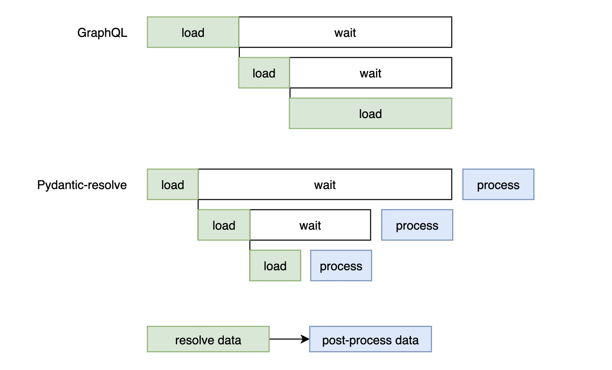
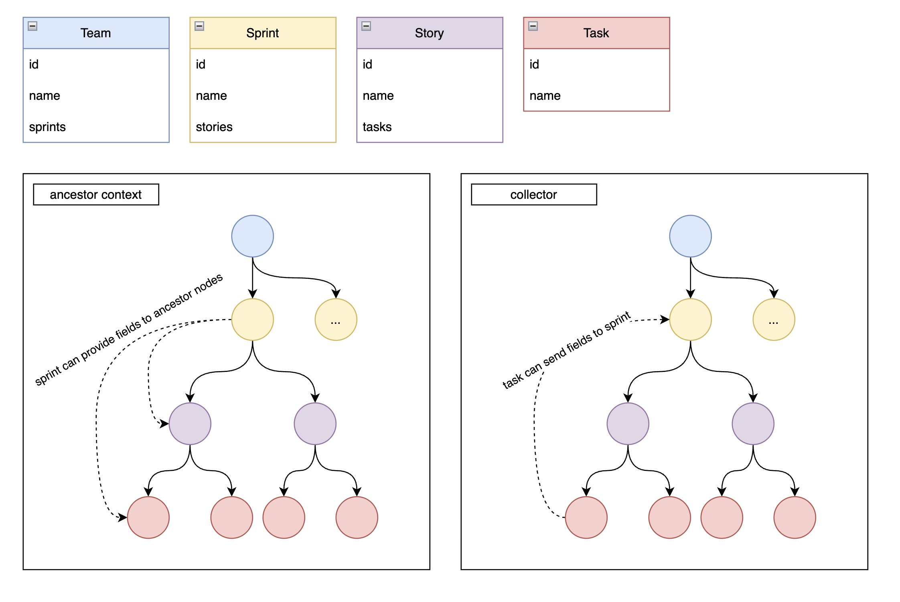
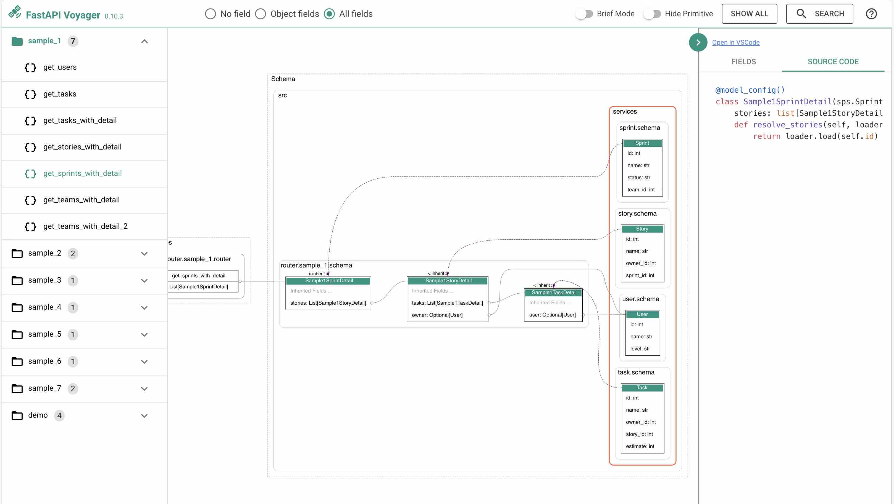

[](https://pypi.python.org/pypi/pydantic-resolve)
[](https://pepy.tech/projects/pydantic-resolve)

[](https://github.com/allmonday/pydantic_resolve/actions/workflows/ci.yml)


Pydantic Resolve provides a class-based approach to composing complex data models without imperative glue code.

It elevates Pydantic from a static data container to a powerful, flexible computation layer.

Built on Pydantic models, it introduces resolve hooks for on-demand data fetching and post hooks for normalization, transformation, and reorganization to meet diverse requirements.

The resolution lifecycle is straightforward: data is loaded level by level through the object.

Compared with GraphQL, both traverse descendant nodes recursively and support resolver functions and DataLoaders. The key difference is post-processing: from the post-processing perspective, resolved data is always ready for further transformation, regardless of whether it came from resolvers or initial input.

Within post hooks, developers can read descendant data, adjust existing fields, compute derived fields, and route values anywhere in the hierarchy.



Post hooks also enable bidirectional data flow: they can read from ancestor nodes and push values up to ancestors, which is useful for adapting data to varied business requirements.




It could be seamlessly integrated with modern Python web frameworks including FastAPI, Litestar, and Django-ninja.

## Installation

```
pip install pydantic-resolve
```

Starting from pydantic-resolve v1.11.0, both pydantic v1 and v2 are supported.


## Supports

- pydantic v1  (stop support in ver 2)
- pydantic v2
- dataclass `from pydantic.dataclasses import dataclass`


## Documentation

- **Documentation**: https://allmonday.github.io/pydantic-resolve/
- **Demo**: https://github.com/allmonday/pydantic-resolve-demo
- **Composition-Oriented Pattern**: https://github.com/allmonday/composition-oriented-development-pattern
- [Resolver Pattern: A Better Alternative to GraphQL in BFF (api-integration).](https://github.com/allmonday/resolver-vs-graphql/blob/master/README-en.md)

## FastAPI Voyager

For FastAPI developers, we can visualize the dependencies of schemas by installing [fastapi-voyager](https://github.com/allmonday/fastapi-voyager)




## Demo: constructing complicated data in 3 steps

Let's take Agile's model for example, it includes Story, Task and User

[source code](https://github.com/allmonday/composition-oriented-development-pattern/tree/master/src/services)

### 1. Define Domain Models

Establish entity relationships model based on business concept.

> which is stable, serves as architectural blueprint


```python
from pydantic import BaseModel

class Story(BaseModel):    
    id: int
    name: str
    owner_id: int
    sprint_id: int

    model_config = ConfigDict(from_attributes=True)

class Task(BaseModel):
    id: int
    name: str
    owner_id: int
    story_id: int
    estimate: int

    model_config = ConfigDict(from_attributes=True)

class User(BaseModel):
    id: int
    name: str
    level: str

    model_config = ConfigDict(from_attributes=True)
```

The dataloader is defined for general usage, if other approach such as ORM relationship is available, it can be easily replaced.
DataLoader's implementation supports all kinds of data sources, from database queries to microservice RPC calls.

```python
from .model import Task
from sqlalchemy.ext.asyncio import AsyncSession
from sqlalchemy import select
import src.db as db
from pydantic_resolve import build_list

# --------- user_id -> user ----------
async def batch_get_users_by_ids(session: AsyncSession, user_ids: list[int]):
    users = (await session.execute(select(User).where(User.id.in_(user_ids)))).scalars().all()
    return users

async def user_batch_loader(user_ids: list[int]):
    async with db.async_session() as session:
        users = await batch_get_users_by_ids(session, user_ids)
        return build_object(users, user_ids, lambda u: u.id)

# ---------- task id -> task ------------
async def batch_get_tasks_by_ids(session: AsyncSession, story_ids: list[int]):
    users = (await session.execute(select(Task).where(Task.story_id.in_(story_ids)))).scalars().all()
    return users

async def story_to_task_loader(story_ids: list[int]):
    async with db.async_session() as session:
        tasks = await batch_get_tasks_by_ids(session, story_ids)
        return build_list(tasks, story_ids, lambda u: u.story_id)
```


### 2. Compose Business Models

Based on a our business logic, create domain-specific data structures through schemas and relationship dataloader

We just need to extend `tasks`, `assignee` and `reporter` for `Story`, and extend `user` for `Task`

Extending new fields is dynamic, depends on business requirement, however the relationships / loaders are restricted by the definition in step 1.


generated by `fastapi-voyager`

[source code](https://github.com/allmonday/composition-oriented-development-pattern/blob/master/src/router/demo/schema.py)

```python
from typing import Optional
from pydantic_resolve import Loader, Collector
from src.services.story.schema import Story as BaseStory

from src.services.task.schema import Task as BaseTask
from src.services.task.loader import story_to_task_loader

from src.services.user.schema import User as BaseUser
from src.services.user.loader import user_batch_loader


class Task(BaseTask):
    user: Optional[BaseUser] = None
    def resolve_user(self, loader=Loader(user_batch_loader)):
        return loader.load(self.owner_id) if self.owner_id else None

class Story(BaseStory):
    tasks: list[Task] = []
    def resolve_tasks(self, loader=Loader(story_to_task_loader)):
        return loader.load(self.id)

    assignee: Optional[BaseUser] = None
    def resolve_assignee(self, loader=Loader(user_batch_loader)):
        return loader.load(self.owner_id) if self.owner_id else None
```

`ensure_subset` decorator is a helper function which ensures the target class's fields (without default value) are strictly subset of class in parameter.

```python
@ensure_subset(BaseStory)
class Story1(BaseModel):
    id: int
    name: str
    owner_id: int
    # sprint_id: int # ignore some fields

    model_config = ConfigDict(from_attributes=True)

    tasks: list[Task1] = []
    def resolve_tasks(self, loader=Loader(story_to_task_loader)):
        return loader.load(self.id)

    assignee: Optional[BaseUser] = None
    def resolve_assignee(self, loader=Loader(user_batch_loader)):
        return loader.load(self.owner_id) if self.owner_id else None

```

> Once this combination is stable, you can consider optimizing with specialized queries to replace DataLoader for enhanced performance, such as ORM's join relationship

### 3. Implement View Model Transformations

Dataset from data-persistent layer can not meet all requirements for view model, adding extra computed fields or adjusting current data is very common.

`post_method` is what you need, it is triggered after all descendant nodes are resolved.

It could read fields from ancestor, collect fields from descendants or modify the data fetched by resolve method.

Let's show them case by case.

#### #1: Collect items from descendants


[source code](https://github.com/allmonday/composition-oriented-development-pattern/blob/master/src/router/demo/schema1.py)

`__pydantic_resolve_collect__` can collect fields from current node and then send them to ancestor node who declared `related_users`.

```python
from typing import Optional
from pydantic import BaseModel, ConfigDict
from pydantic_resolve import Loader, Collector, ensure_subset
from src.services.story.schema import Story as BaseStory

from src.services.task.schema import Task as BaseTask
from src.services.task.loader import story_to_task_loader

from src.services.user.schema import User as BaseUser
from src.services.user.loader import user_batch_loader


class Task1(BaseTask):
    __pydantic_resolve_collect__ = {'user': 'related_users'}  # Propagate user to collector: 'related_users'
    
    user: Optional[BaseUser] = None
    def resolve_user(self, loader=Loader(user_batch_loader)):
        return loader.load(self.owner_id) if self.owner_id else None

@ensure_subset(BaseStory)
class Story1(BaseModel):
    id: int
    name: str
    owner_id: int
    model_config = ConfigDict(from_attributes=True)

    tasks: list[Task1] = []
    def resolve_tasks(self, loader=Loader(story_to_task_loader)):
        return loader.load(self.id)

    assignee: Optional[BaseUser] = None
    def resolve_assignee(self, loader=Loader(user_batch_loader)):
        return loader.load(self.owner_id) if self.owner_id else None

    # ----- collect from descendants ---------
    related_users: list[BaseUser] = []
    def post_related_users(self, collector=Collector(alias='related_users')):
        return collector.values()
```

#### #2: Compute extra fields from current data


post methods are executed after all resolve_methods are resolved, so we can use it to calculate extra fields.

[source code](https://github.com/allmonday/composition-oriented-development-pattern/blob/master/src/router/demo/schema2.py)

```python
from typing import Optional
from pydantic import BaseModel, ConfigDict
from pydantic_resolve import Loader, ensure_subset
from src.services.story.schema import Story as BaseStory

from src.services.task.schema import Task as BaseTask
from src.services.task.loader import story_to_task_loader

from src.services.user.schema import User as BaseUser
from src.services.user.loader import user_batch_loader


class Task2(BaseTask):
    user: Optional[BaseUser] = None
    def resolve_user(self, loader=Loader(user_batch_loader)):
        return loader.load(self.owner_id) if self.owner_id else None

@ensure_subset(BaseStory)
class Story2(BaseModel):
    id: int
    name: str
    owner_id: int
    model_config = ConfigDict(from_attributes=True)

    tasks: list[Task2] = []
    def resolve_tasks(self, loader=Loader(story_to_task_loader)):
        return loader.load(self.id)

    assignee: Optional[BaseUser] = None
    def resolve_assignee(self, loader=Loader(user_batch_loader)):
        return loader.load(self.owner_id) if self.owner_id else None

    # ---- calculate extra fields ----
    total_estimate: int = 0
    def post_total_estimate(self):
        return sum(task.estimate for task in self.tasks)
```

### #3: Propagate ancestor data to descendants through `ancestor_context`


`__pydantic_resolve_expose__` could expose specific fields from current node to it's descendant.

alias_names should be global unique inside root node.

descendant nodes could read the value with `ancestor_context[alias_name]`.

[source code](https://github.com/allmonday/composition-oriented-development-pattern/blob/master/src/router/demo/schema3.py)

```python
from typing import Optional
from pydantic import BaseModel, ConfigDict
from pydantic_resolve import Loader, ensure_subset
from src.services.story.schema import Story as BaseStory

from src.services.task.schema import Task as BaseTask
from src.services.task.loader import story_to_task_loader

from src.services.user.schema import User as BaseUser
from src.services.user.loader import user_batch_loader

class Task3(BaseTask):
    user: Optional[BaseUser] = None
    def resolve_user(self, loader=Loader(user_batch_loader)):
        return loader.load(self.owner_id) if self.owner_id else None

    fullname: str = ''
    def post_fullname(self, ancestor_context):  # Access story.name from parent context
        return f'{ancestor_context["story_name"]} - {self.name}'

@ensure_subset(BaseStory)
class Story3(BaseModel):
    __pydantic_resolve_expose__ = {'name': 'story_name'}  # expose to descendants.

    id: int
    name: str
    owner_id: int
    model_config = ConfigDict(from_attributes=True)

    tasks: list[Task3] = []
    def resolve_tasks(self, loader=Loader(story_to_task_loader)):
        return loader.load(self.id)

    assignee: Optional[BaseUser] = None
    def resolve_assignee(self, loader=Loader(user_batch_loader)):
        return loader.load(self.owner_id) if self.owner_id else None
```

### 4. Execute Resolver().resolve()

```python
from pydantic_resolve import Resolver

stories = [Story(**s) for s in await query_stories()]
data = await Resolver().resolve(stories)
```

`query_stories()` returns `BaseStory` list, after we transformed it into `Story`, resolve and post fields are initialized as default value, after `Resolver().resolve()` finished, all these fields will be resolved and post-processed to what we expected.

## Testing and Coverage

```shell
tox
```

```shell
tox -e coverage
python -m http.server
```

Current test coverage: 97%

## Community

[Discord](https://discord.com/channels/1197929379951558797/1197929379951558800)
